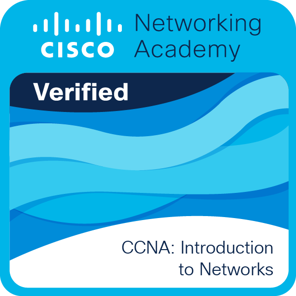
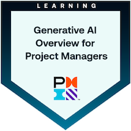
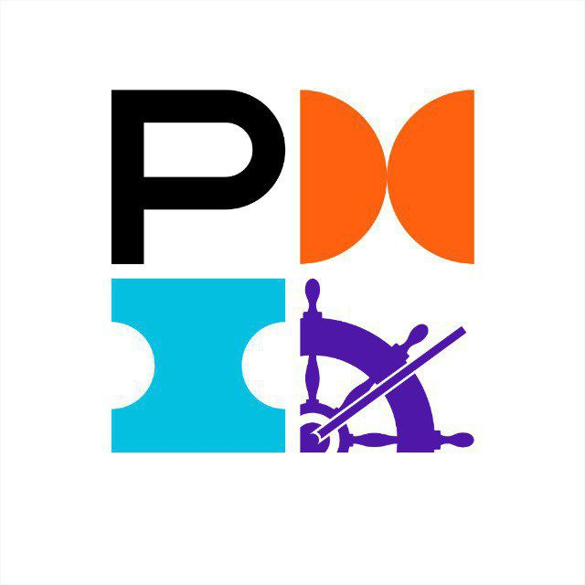

# Hello, I'm Emanuele! 👋

I'm a developer and malware analyst from Italy.
I'm currently studying Computer Science at [I.T.I. G. Ferraris, Napoli (NA)](https://itiferraris.edu.it), Italy. 💜

    
    

    

## Table of contents

- [About me](#about-me)
- [Skills overview](#skills-overview)
- [Certifications, badges and experiences](#certifications-badges-and-experiences)
- [My gear](#my-gear)
    
## About me

I’m a software developer and computer science student with experience across frontend and backend development, databases, containerized applications, and Linux/Windows server management.

I started programming at the age of 9 and have since worked on a wide range of projects, from small private initiatives to large public ones. My primary languages are JavaScript/TypeScript and Kotlin (my current favorite), with additional experience in C, C++, and Assembly for malware analysis and low-level work.

I’m currently diving deeper into malware analysis and reverse engineering, and I enjoy learning new technologies and tackling challenging problems.

Below is a list of the languages, frameworks, tools, and technologies I’ve worked with over the years.
## Skills overview

  <strong>Mostly frontend</strong>   
    
  
  
  
  
  
  
  
  
  
  

  <strong>Backend and others</strong>  
   
  
  
    
  
  
  
  

  <strong>Database</strong>  
   
  
  
  
  

  <strong>Libraries, frameworks and other tools</strong>   
    
  
  
  
  
  
  
  
  
  
  

  <strong>Object store systems</strong>   
   
  
  

  <strong>Operating systems and virtualization suites</strong>
   
  
  

## Certifications, badges and experiences

### Cisco

#### IT Essentials

- **Obtained on**: October 21, 2024

#### CCNAv7.0

- **Obtained on**: June 10, 2025

### Project Management Institute

#### Kickoff ™ Predictive

- **Obtained on**: June 14, 2025

#### Kickoff ™ Agile

- **Obtained on**: June 14, 2025

#### Generative AI Overview for Project Managers

- **Obtained on**: June 14, 2025

### Project Management Institute - Southern Italy Chapter

#### Project Management Skills for Life® (PMS4L)

- **Date**: February 17, 2024

#### Project Management Olympic Games (PMOGs)

- **Date**: May 19, 2025
- **Team score**: 4th out of 20 participating teams ([**LinkedIn post**](https://www.linkedin.com/posts/pmi-sic_pmisic-pmogs2025-projectmanagement-activity-7332995364305764353-Ztux/))

---

###### _"PMI", "Kickoff ™", "Project Management Skills for Life®"_  are marks of Project Management Institute, Inc.

## The IDEs I use

  
  
  
  

## My gear

### Desktop 🖥

- **CPU**: [AMD Ryzen 5 5600X](https://amzn.eu/d/09dRNTJG)
- **GPU**: [XFX SWIFT 210 - RADEON RX 6600 XT](https://a.co/d/04lwzsG)
- **RAM**: [16GB DDR4 3200MHz](https://amzn.eu/d/0aAHP1hz)
- **Storage**: [2 x 500 NVMe SSD](https://amzn.eu/d/0cssELas) + 3 x 1TB SATA HDD (Recovered from dismissed servers)
- **OS**: Windows 10 Pro + [Arch Linux](https://archlinux.org/) (KDE Plasma)
- **Case**: [Nfortec Lynx Gaming Tower](https://amzn.eu/d/0bjeoUCO) (In the picture on the right!)

### Laptop 💻

**Model**: [Acer Nitro 5 AN515-58](https://amzn.eu/d/04XJV4WW) (In the picture on the right!)

- **CPU**: Intel Core i9-12900H
- **GPU**: NVIDIA GeForce RTX 4060 + Intel Iris XE Graphics (NVIDIA Optimus)
- **RAM**: 32GB DDR5 4800MHz
- **Storage**: 2 x 1TB NVMe SSD + 1 x 1TB SATA HDD
- **OS**: [Arch Linux](https://archlinux.org/) (KDE Plasma) + Windows 11 Pro

### Other peripherals 🖱️

- **Keyboard**: [Fnatic STREAK65 LP US-Layout](https://amzn.eu/d/01CSjU6v)
- **Mouse(s)**: [Logitech G PRO X Superlight](https://amzn.eu/d/0faJbCjL) for the desktop **AND** [Logitech Pebble Mouse 2 M350s](https://amzn.eu/d/0ermqZaH) for the notebook
- **Headphones**: [Logitech G PRO X](https://amzn.eu/d/06gAj6u9)
- **Monitor(s)**: [2 x 32" 2K (2560 x 1440) 166Hz - LG 32GN650](https://amzn.eu/d/0eDv1oxe)
