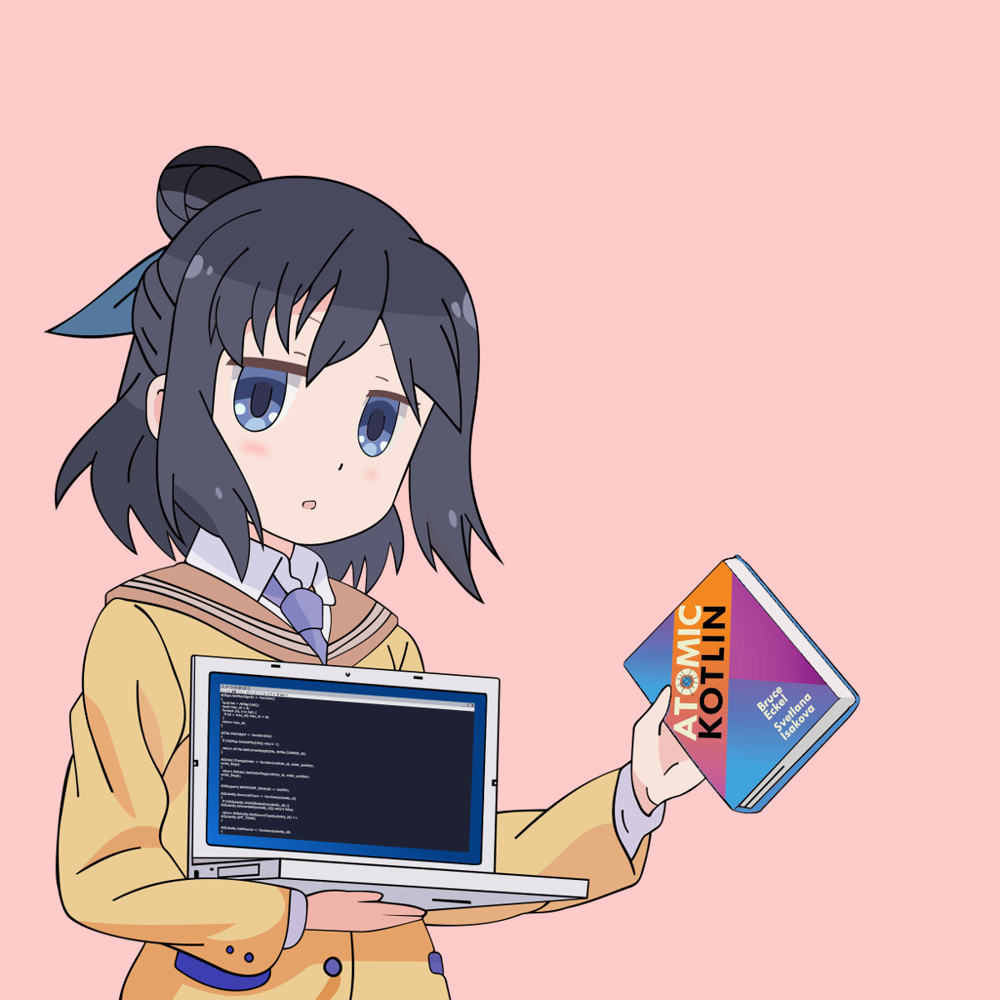
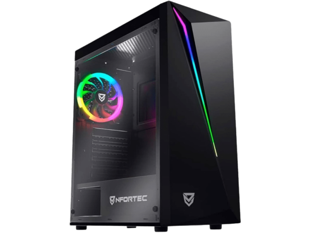

# Hello, I'm Emanuele! 👋



I'm a developer (and an aspiring photographer) from Italy.
I'm currently studying Computer Science at [I.T.I. G. Ferraris, Napoli (NA)](https://itiferraris.edu.it), Italy. 💜

<p float="left" align="center">
    
    
    
</p>

<br clear="left">
<br clear="left">
<br clear="left">

## My skills and passions 🚀

Even though I'm still a student, I have a lot of experience in software development, mainly thanks to the fact that I'm
an inquisitive person, and I'm very passionate about what I do.
Plus, I’m a rapid learner, and I'm always looking for new things to learn and new challenges.
My experience ranges from frontend development to backend development, and I've also worked with databases, container
applications, and I know how to deal with Linux and Windows servers management and configuration.

My very first approach to CS was when I was 9, and I started learning JavaScript and, since then, I've matured a lot of
experience with contributions to little private projects and big public ones.
I moved from JavaScript to TypeScript (which was my main language for a very long time),
then I started learning Java, which opened me the doors to the JVM-compatible languages world.
After that, I started learning Kotlin, which is now my favorite language, and the one I've worked with most (well...
_excluding JS and TS of course_).

I've also had a fair share of experience with C# and Rust, and I'm currently learning how to use them properly.

A new passion of mine is malware analysis and reverse engineering, and I'm currently studying it in my free time, and
hope to be able to create something in that matter in the future.

Following this, you will find an extensive list of the languages, frameworks, tools and technologies I've worked with during the past years in the form of a Kotlin data class.
I find this to be a unique way to show off my skills, and it's also a way to show my love for Kotlin.

## My overview 📝

A textual version is available [here](/README.old.md).
This is Kotlin code that you can run [here](https://pl.kotl.in/ywOy0eZE1), or you can read it!

```kt
enum class Status {
    MASTERED,
    LEARNING
}

typealias ListEntry = Pair<String, Status>

data class AboutMe(
    val fullname: String = "Emanuele Iannuzzi",
    val nickname: String = "Tekno",
    val location: String = "Italy",
    val contacts: List<Pair<String, String>> =
        listOf(
            "email" to "tekno@hiri.dev",
            "github" to "https://github.com/TeknoSenpai",
            "discord" to "the.avogatto"
        ),
    val languages: Map<String, List<ListEntry>> =
        mapOf(
            "Frontend" to
                    listOf(
                        "HTML5" to Status.MASTERED,
                        "CSS3" to Status.MASTERED,
                        "Sass" to Status.MASTERED,
                        "Less" to Status.MASTERED,
                        "JavaScript" to Status.MASTERED,
                        "TypeScript" to Status.MASTERED
                    ),
            "Backend" to
                    listOf(
                        "Kotlin" to Status.MASTERED,
                        "Java" to Status.MASTERED,
                        "C#" to Status.LEARNING,
                        "Rust" to Status.LEARNING
                    ),
            "Database query" to
                    listOf(
                        "SQL" to Status.LEARNING,
                        "MongoDB" to Status.LEARNING
                    ),
            "Scripting" to
                    listOf(
                        "bash" to Status.LEARNING,
                        "zsh" to Status.LEARNING,
                        "python" to Status.MASTERED
                    )
        ),
    val frameworks: Map<String, List<ListEntry>> =
        mapOf(
            "Frontend" to
                    listOf(
                        "Angular CLI" to Status.LEARNING,
                        "Vue.js" to Status.LEARNING,
                        "Nuxt.js" to Status.LEARNING,
                        "TailwindCSS" to Status.LEARNING
                    ),
            "Backend" to listOf("Nest.js" to Status.MASTERED, "Ktor" to Status.MASTERED)
        ),
    val technologies: Map<String, List<ListEntry>> =
        mapOf(
            "Package Managers" to listOf("npm" to Status.MASTERED, "yarn" to Status.MASTERED),
            "Error reporting" to listOf("Sentry" to Status.MASTERED),
            "Container application" to listOf("Docker" to Status.LEARNING),
            "Databases" to
                    listOf(
                        "MySQL" to Status.MASTERED,
                        "MariaDB" to Status.MASTERED,
                        "PostgreSQL" to Status.MASTERED,
                        "MongoDB" to Status.LEARNING,
                        "Redis" to Status.LEARNING
                    ),
            "Server" to
                    listOf(
                        "Express" to Status.MASTERED,
                        "Fastify" to Status.LEARNING,
                        "Apache 2 (HTTPD)" to Status.MASTERED,
                        "Nginx" to Status.MASTERED,
                    ),
            "Object Storage" to listOf("Amazon S3" to Status.MASTERED, "MinIO" to Status.MASTERED)
        ),
    val spokenLanguages: List<ListEntry> =
        listOf(
            "Italian" to Status.MASTERED,
            "English (UK)" to Status.MASTERED,
            "French" to Status.LEARNING
        ),
    val operatingSystems: Map<String, List<String>> =
        mapOf("desktop" to listOf("Win10", "Manjaro"), "laptop" to listOf("Manjaro", "Win11")),
    val ides: List<String> =
        listOf(
            "WebStorm",
            "IntelliJ IDEA",
            "GoLand",
            "PyCharm",
            "Visual Studio",
            "Visual Studio Code"
        ),
) {
    fun rightPad(inStr: String) = inStr + " ".repeat(30 - inStr.length)

    fun formatKey(inStr: String): String {
        val targetWidth = 38
        val hyphenCount = 3
        val totalPadding = targetWidth - hyphenCount * 2 - inStr.length

        val paddingLeft = totalPadding / 2
        val paddingRight = totalPadding - paddingLeft

        return "---" + " ".repeat(paddingLeft) + inStr + " ".repeat(paddingRight) + "---\n"
    }

    fun getStringFromListEntryMap(v: Map<String, List<ListEntry>>, name: String): String {
        var ret = "$name:\n"
        for (i in v) {
            ret += formatKey(i.key)
            for (j in i.value) {
                ret += "${rightPad(j.first)}${j.second}\n"
            }
        }
        return ret + "\n"
    }

    override fun toString(): String {
        var ret = "Full name: $fullname; Nickname: $nickname; Location: $location; Contacts: ${
            contacts.joinToString(", ") { "${it.first}: ${it.second}" }
        }\n"
        ret += getStringFromListEntryMap(languages, "Languages")
        ret += getStringFromListEntryMap(frameworks, "Frameworks")
        ret += getStringFromListEntryMap(technologies, "Technologies")
        ret += "Spoken languages:\n${spokenLanguages.joinToString("\n") { "${rightPad(it.first)}${it.second}" }}"
        return ret
    }
}

fun main() {
    print(AboutMe())
}
```

## My gear 🖥️

### Desktop 🖥



- **CPU**: [AMD Ryzen 5 5600X](https://amzn.eu/d/09dRNTJG)
- **GPU**: [XFX SWIFT 210 - RADEON RX 6600 XT](https://a.co/d/04lwzsG)
- **RAM**: [16GB DDR4 3200MHz](https://amzn.eu/d/0aAHP1hz)
- **Storage**: [2 x 500 NVMe SSD](https://amzn.eu/d/0cssELas) + 3 x 1TB SATA HDD (Recovered from dismissed servers)
- **OS**: Windows 10 Pro + [Manjaro Linux](https://manjaro.org/) (KDE Plasma)
- **Case**: [Nfortec Lynx Gaming Tower](https://amzn.eu/d/0bjeoUCO) (In the picture on the right!)

### Notebook 💻


**Model**: [Acer Nitro 5 AN515-58](https://amzn.eu/d/04XJV4WW) (In the picture on the right!)

- **CPU**: Intel Core i9-12900H
- **GPU**: NVIDIA GeForce RTX 4060 + Intel Iris XE Graphics (NVIDIA Optimus)
- **RAM**: 32GB DDR5 4800MHz
- **Storage**: 2 x 1TB NVMe SSD + 1 x 1TB SATA HDD
- **OS**: [Manjaro Linux](https://manjaro.org/) (KDE Plasma) + Windows 11 Pro

### Camera 📷


**Model**: [Nikon D800](https://en.wikipedia.org/wiki/Nikon_D800)

- **Lens**: [Nikon NIKKOR AF-S 24-70mm f/2.8G ED](https://amzn.eu/d/06bgCW6t)
- **Storage**: [SanDisk 64GB Extreme PRO SDXC](https://amzn.eu/d/0aVbIknj)
- **Tripod**: [Manfrotto 055XPROB](https://amzn.eu/d/0iG5Zxu2)
- **Bag**: [Lowepro ProTactic 450 AW II](https://amzn.eu/d/01wSD2wE)
- **Flash**: [Nikon SB-700](https://amzn.eu/d/0amrT8Tq)

### Other peripherals 🖱️

- **Keyboard**: [Fnatic STREAK65 LP US-Layout](https://amzn.eu/d/01CSjU6v)
- **Mouse(s)**: [Logitech G PRO X Superlight](https://amzn.eu/d/0faJbCjL) for the desktop **AND** [Logitech Pebble Mouse 2 M350s](https://amzn.eu/d/0ermqZaH) for the notebook
- **Headphones**: [Logitech G PRO X](https://amzn.eu/d/06gAj6u9)
- **Monitor(s)**: [2 x 32" 2K (2560 x 1440) 166Hz - LG 32GN650](https://amzn.eu/d/0eDv1oxe)

## My projects 🛠️

I'm currently working on a lot of projects, but here are some of the most important ones:

- **[NISD](https://github.com/NISD-Bot)**: It's a multipurpose bot that can do a lot of things, from moderation to fun
  commands.
  (Closed source)
    - Technologies used:
        - **Backend**: Java, JDA, MongoDB
- **[Hosto](https://github.com/HostoCC)**: A simple (yet complete), fast, and secure file hosting and file serve
  platform that I'm developing with my friends.
  (Closed source)
    - Technologies used:
        - **Frontend**: Angular CLI, TailwindCSS
        - **Backend**: Ktor (Kotlin on JVM), PostgreSQL

I'm also planning on releasing a multitude of other Open Source projects, but I can't talk about them yet. Stay tuned!

---
