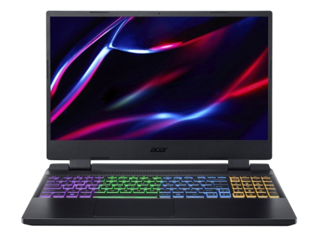

# Hello, I'm Emanuele! 👋

I'm a developer (and an aspiring Project Manager) from Italy.
I'm currently studying Computer Science at [I.T.I. G. Ferraris, Napoli (NA)](https://itiferraris.edu.it), Italy. 💜

    
    
    

    

    
## My skills and passions 🚀

Even though I'm still a student, I have a lot of experience in software development, mainly thanks to the fact that I'm
an inquisitive person, and I'm very passionate about what I do.
Plus, I’m a rapid learner, and I'm always looking for new things to learn and new challenges.
My experience ranges from frontend development to backend development, and I've also worked with databases, container
applications, and I know how to deal with Linux and Windows servers management and configuration.

My very first approach to CS was when I was 9, and I started learning JavaScript and, since then, I've matured a lot of
experience with contributions to little private projects and big public ones.
I moved from JavaScript to TypeScript (which was my main language for a very long time),
then I started learning Java, which opened me the doors to the JVM-compatible languages world.
After that, I started learning Kotlin, which is now my favorite language, and the one I've worked with most (well...
_excluding JS and TS of course_).

I've also had a fair share of experience with C# and Rust, and I'm currently learning how to use them properly.

A new passion of mine is malware analysis and reverse engineering, and I'm currently studying it in my free time, and
hope to be able to create something in that matter in the future.

Following this, you will find an extensive list of the languages, frameworks, tools and technologies I've worked with during the past years.
## My overview 📝

  <strong>Mostly frontend</strong>   
    
  
  
  
  
  
  
  
  

  <strong>Backend and others</strong>  
   
  
  
    
  
  
  
  

  <strong>Database</strong>  
   
  
  
  
  

  <strong>Libraries and framework</strong>   
    
  
  
  
  
  
  
  

  <strong>Services and tools</strong>   
   
  
  

## 📝 Favourite Editors

  
  
  
  

## My gear 🖥️

### Desktop 🖥

- **CPU**: [AMD Ryzen 5 5600X](https://amzn.eu/d/09dRNTJG)
- **GPU**: [XFX SWIFT 210 - RADEON RX 6600 XT](https://a.co/d/04lwzsG)
- **RAM**: [16GB DDR4 3200MHz](https://amzn.eu/d/0aAHP1hz)
- **Storage**: [2 x 500 NVMe SSD](https://amzn.eu/d/0cssELas) + 3 x 1TB SATA HDD (Recovered from dismissed servers)
- **OS**: Windows 10 Pro + [Manjaro Linux](https://manjaro.org/) (KDE Plasma)
- **Case**: [Nfortec Lynx Gaming Tower](https://amzn.eu/d/0bjeoUCO) (In the picture on the right!)

### Notebook 💻

**Model**: [Acer Nitro 5 AN515-58](https://amzn.eu/d/04XJV4WW) (In the picture on the right!)

- **CPU**: Intel Core i9-12900H
- **GPU**: NVIDIA GeForce RTX 4060 + Intel Iris XE Graphics (NVIDIA Optimus)
- **RAM**: 32GB DDR5 4800MHz
- **Storage**: 2 x 1TB NVMe SSD + 1 x 1TB SATA HDD
- **OS**: [Manjaro Linux](https://manjaro.org/) (KDE Plasma) + Windows 11 Pro

### Camera 📷

**Model**: [Nikon D800](https://en.wikipedia.org/wiki/Nikon_D800)

- **Lens**: [Nikon NIKKOR AF-S 24-70mm f/2.8G ED](https://amzn.eu/d/06bgCW6t)
- **Storage**: [SanDisk 64GB Extreme PRO SDXC](https://amzn.eu/d/0aVbIknj)
- **Tripod**: [Manfrotto 055XPROB](https://amzn.eu/d/0iG5Zxu2)
- **Bag**: [Lowepro ProTactic 450 AW II](https://amzn.eu/d/01wSD2wE)
- **Flash**: [Nikon SB-700](https://amzn.eu/d/0amrT8Tq)

### Other peripherals 🖱️

- **Keyboard**: [Fnatic STREAK65 LP US-Layout](https://amzn.eu/d/01CSjU6v)
- **Mouse(s)**: [Logitech G PRO X Superlight](https://amzn.eu/d/0faJbCjL) for the desktop **AND** [Logitech Pebble Mouse 2 M350s](https://amzn.eu/d/0ermqZaH) for the notebook
- **Headphones**: [Logitech G PRO X](https://amzn.eu/d/06gAj6u9)
- **Monitor(s)**: [2 x 32" 2K (2560 x 1440) 166Hz - LG 32GN650](https://amzn.eu/d/0eDv1oxe)

## Certifications, badges and experiences 📖

### Cisco

#### IT Essentials

- **Obtained on**: October 21, 2024

#### CCNAv7.0

- **Obtained on**: June 10, 2025

### Project Management Institute

#### Kickoff ™ Predictive

- **Obtained on**: June 14, 2025

#### Kickoff ™ Agile

- **Obtained on**: June 14, 2025

### Project Management Institute - Southern Italy Chapter

#### Project Management Skills for Life® (PMS4L)

- **Date**: February 17, 2024

#### Project Management Olympic Games (PMOGs)

- **Date**: May 19, 2025
- **Team score**: 4th out of 20 participating teams ([**LinkedIn post**](https://www.linkedin.com/posts/pmi-sic_pmisic-pmogs2025-projectmanagement-activity-7332995364305764353-Ztux/))

---

###### _"PMI", "Kickoff ™", "Project Management Skills for Life®"_  are marks of Project Management Institute, Inc.
